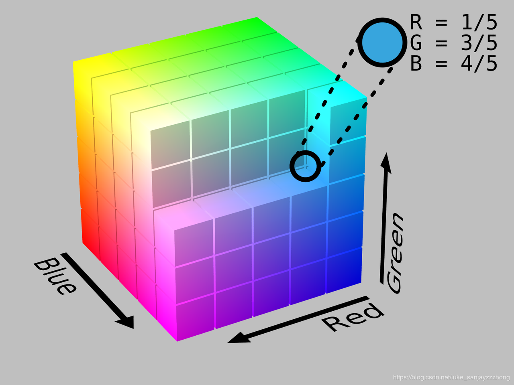
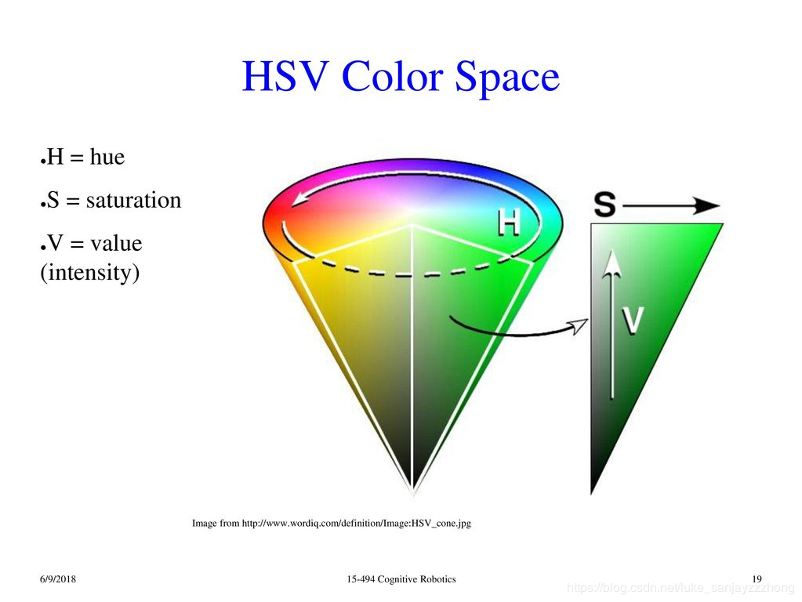
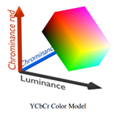
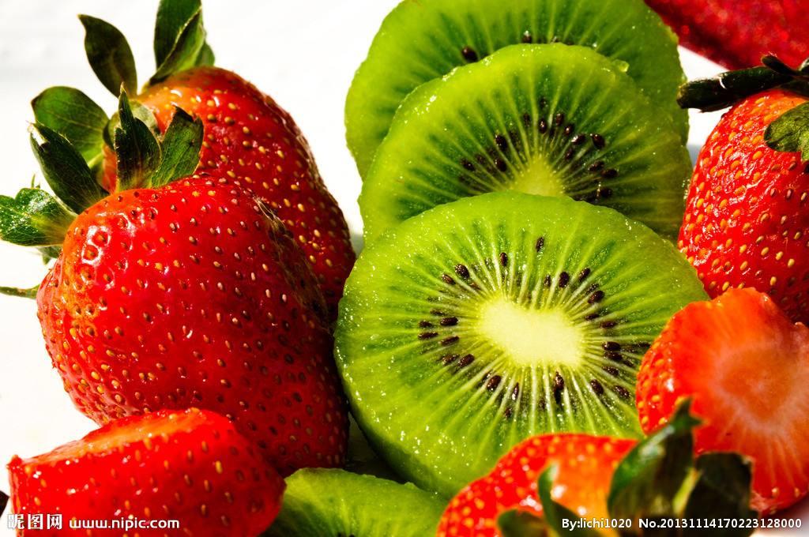

## 色彩空间
对于不同的问题我们通常采用不同的通道来处理

#### RGB
RGB色彩空间, 我们用Red红色通道, Green绿色通道, Blue蓝色通道三个值来表示一个特定的色彩


#### HSV/HIS
* H通道：Hue，色调/色彩。这个通道代表颜色。
* S通道：Saturation，饱和度。饱和度越高，色彩越纯。
* V通道：Value，明暗。数值越高，越明亮。

###### 应用场景
1. 某些由于光照不同造成的视觉感知不同的场景下，我们通常用Value这个通道进行计算，通过计算梯度，可以较好的提取物体边缘
2. 前景饱和度较高，背景采用饱和度较低的颜色来衬托前景，这时Saturation这个通道的信息就非常有用了
3. 在某些室内场景下，风格较为单一，一般一个物体只有一种颜色，这时候Hue这个通道就显得尤为重要了

#### YCbCr/YUV
* YCbCr其中Y是指亮度分量，Cb指蓝色色度分量，而Cr指红色色度分量
* 主要的子采样格式有 YCbCr 4:2:0、YCbCr 4:2:2 和 YCbCr 4:4:4。
* 其实YCbCr是YUV经过缩放和偏移的翻版，一般人们所讲的YUV大多是指YCbCr  
* U = R - Y  
* V = B - Y  


#### 色彩图像分割
* 灰度图像大多通过算子寻找边缘和区域生长融合来分割图像。  
* 彩色图像增加了色彩信息，可以通过不同的色彩值来分割图像，常用彩色空间HSV/HSI, RGB 进行分割。  
* HSV 色彩分割  
    * `mask = cv.inRange(hsv, lowerb=low_hsv, upperb=up_hsv)`
    * lowerb：lower boundary下限，scalar类型的像素值，单通道scalar取一个值就行，彩图3通道scalar三个值；  
    * upperb：上限，类型与lowerb同理；  
    * 这样就能把符合要求(HSV各分量在下限和上限之间的像素)给分割出来      

    
#### 代码片段执行时间
* getTickCount()：用于返回从操作系统启动到当前所经的计时周期数，看名字也很好理解，get Tick Count(s)。  
* getTickFrequency()：用于返回CPU的频率。get Tick Frequency。这里的单位是秒，也就是一秒内重复的次数。  
```python
t1 = cv.getTickCount()
picture_message(scr)
t2 = cv.getTickCount()
time = 1000 * (t2-t1)/cv.getTickFrequency()
print('Time is %s ms'% time)
```


