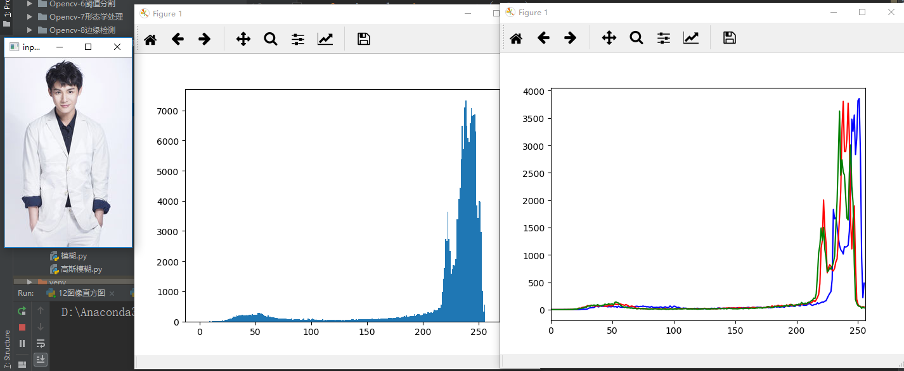
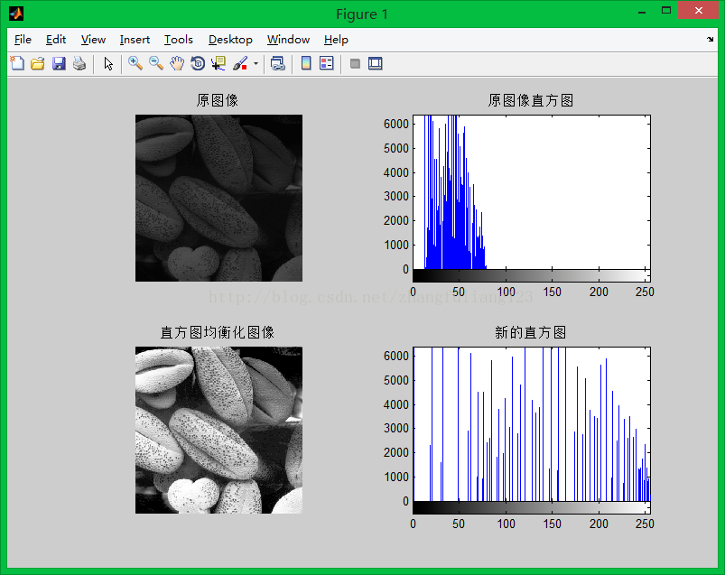
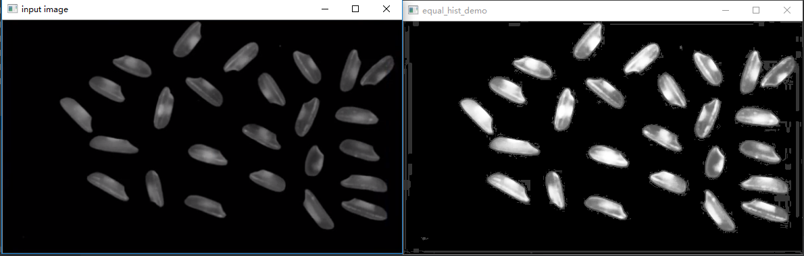
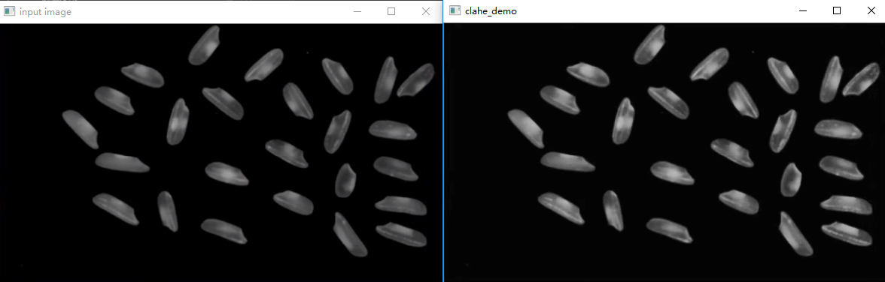
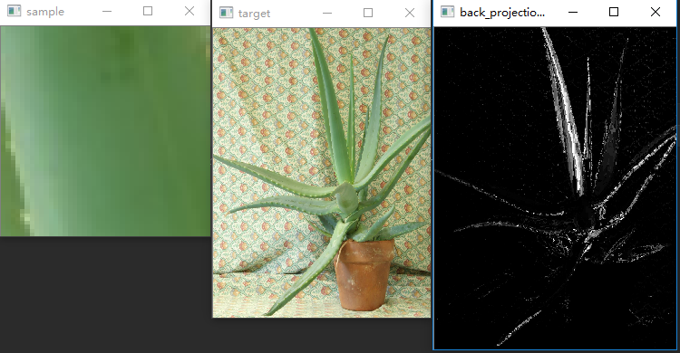

## 图像直方图
直方图广泛应用于许多计算机视觉应用中。通过标记帧和帧之间显著的边缘和颜色的统计变化，来检测视频中场景的变换。通过在每个兴趣点设置一个有相近特征的直方图所构成的标签，用以确定图像中的兴趣点。边缘、色彩、角度等直方图构成了可以被传递给目标识别分类器的一个通用特征类型。色彩和边缘的直方图还可以用来识别网络视频是否被复制等。直方图是计算机视觉中最经典的工具之一，也是一个很好的图像特征表示手段。
* 图像直方图是用一表示数字图像中亮度分布的直方图，标绘了图像中每个亮度值的像素数  
* 灰度直方图是一幅图像中个像素灰度值出现次数或频数的统计结果，它只反映该图像中灰度值出现的频率，而未反映某一灰度值像素所在的位置  
        
#### 插件安装
在当前工程目录cmd终端中执行`pip install matplotlib`

#### 直方图术语
* dims：需要统计的特征的数目。例如：dims=1，表示我们仅统计灰度值。   
* bins：每个特征空间子区段的数目。   
* range：每个特征空间的取值范围, 灰度值范围通常是[0,256]  

#### pyplot绘制直方图
* pyplot提供了类似matlab的绘图框架
`import matplolib.pyplot as plt`
* API `hist(数据源，像素级)`
    * 功能： 根据数据源合金像素级绘制直方图
    * 数据源： 图像，必须是一维数组
    * 像素级： 一般是256，指[0, 255]
* API `ravel b = a.ravel()`
    * 功能： 将多维数组降为一维数组
    * 格式： 一维数组=多维数组.revel()

#### 直方图数据统计
* API
`hist = cv2.calcHist(images, channels, mask, histSize, ranges, accumulate)`
    * channels： 指定通道, 彩色图像可以使[0],[1],[2]分别对应通道B，G，R
    * mask： 掩码图像   
        * 统计整幅图像的直方图，设为None。  
        * 统计图像某一部分的直方图时，需要掩码图像  
        * 生成掩码图像: `mask = np.zeros(image.shape, np.uint8)`  
    * histSize： BINS的数量，如 [256]
    * ranges： 像素值范围，例如：[0, 255]
    * accumulate： 累计标识
        * 默认值为false
        * 如果被设置为true,则直方图在开始分配时不会被清零
        * 该参数允许从多个对象中计算单个直方图，或者用户实施更新直方图
        * 多个直方图的累计结果，用户对一组图像计算直方图
    * 返回值： hist直方图


#### 直方图均衡化
直方图均衡化是图像处理领域中利用图像直方图对对比度进行调整的方法.通过这种方法，亮度可以更好地在直方图上分布.这样就可以用于增强局部的对比度而不影响整体的对比度

###### 全局均衡化
* API
`dst = cv2.equalizeHist(gray)`

###### 局部均衡化
局部直方图均衡化，也就是是说把整个图像分成许多小块（比如按8*8作为一个小块），那么对每个小块进行均衡化。
* API
```python
clahe = cv2.createCLAHE(clipLimit=2.0, tileGridSize=(8, 8))
dst = clahe.apply(gray)
# clipLimit参数表示对比度的大小。
# tileGridSize参数表示每次处理块的大小 。
```


#### 直方图比较
直方图比较可以达到图像相似度比较，分析图像之间关系的目的
* API  
`cv2.compareHist(H1, H2, method)`
    * H1，H2 分别为要比较图像的直方图
    * method - 比较方式
    * 比较方式（method）
        * 相关性比较 (method=cv.HISTCMP_CORREL) 值越大，相关度越高，最大值为1，最小值为0
        * 卡方比较(method=cv.HISTCMP_CHISQR 值越小，相关度越高，最大值无上界，最小值0
        * 巴氏距离比较(method=cv.HISTCMP_BHATTACHARYYA) 值越小，相关度越高，最大值为1，最小值为0

#### 直方图反向投影
根据样本的直方图，找到图像与样本相似的地方，即反向投影技术。
通常用HSV色彩空间的HS两个通道直方图模型。
###### 步骤
1. 建立直方图模型
2. 计算待测图像直方图并映射到模型中
3. 从模型反向计算生成图像
###### API
`dst = cv2.calcBackProject(target_hsv, [0, 1], roihist, [0, 180, 0, 256], 1)`



