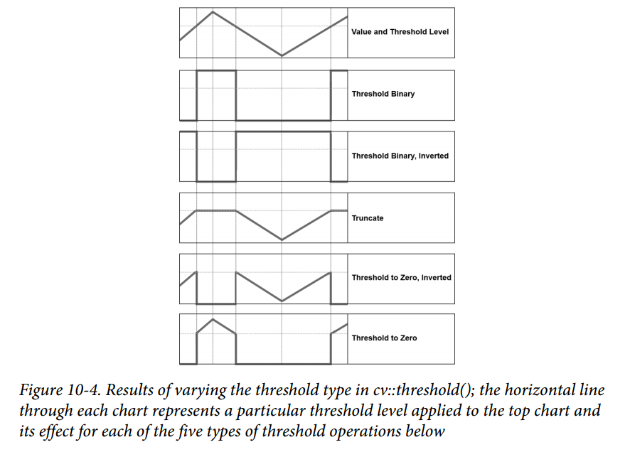

## 图像二值化
图像的二值化，就是将图像上的像素点的灰度值设置为0或255，也就是将整个图像呈现出明显的只有黑和白的视觉效果。

#### 全局阈值二值化 API
`cv2.threshold (src, threshold, maxValue, method)`
* src : 源图
* threshold : 设定的阈值
* maxValue : 设定的最大值
* method : 阈值化的方法 
    * cv2.THRESH_BINARY：大于阈值的像素点灰度值设定为 maxValue （如8位灰度值最大为255），灰度值小于阈值的像素点的灰度值设定为0。
    * cv2.THRESH_BINARY_INV： 大于阈值的像素点的灰度值设定为0，而小于阈值的像素点的灰度值设定为 maxValue。
    * cv2.THRESH_TRUNC：像素点的灰度值小于阈值不改变，大于阈值的灰度值的像素点设定为该阈值。
    * cv2.THRESH_TOZERO：像素点的灰度值小于该阈值的不进行任何改变，而大于该阈值的部分，其灰度值全部变为0。
    * cv2.THRESH_TOZERO_INV： 像素点的灰度值大于该阈值的不进行任何改变，像素点的灰度值小于该阈值的，其灰度值全部变为0。
    *   
    * cv2.THRESH_OTSU： OTSU方法自动寻找阈值，Otsu’s 二值化算法就是对一副直方图双峰图像自动根据其直方图计算出一个阈值。
    * cv2.THRESH_TRIANGLE： Triangle算法自动寻找阈值，直方图只有单波峰时效果较好。
    * cv2.THRESH_MASK： 不支持。
* Tips
    * 特殊值#THRESH_OTSU或#THRESH_TRIANGLE可以与上述值之一组合。 在这些情况下，函数使用Otsu或Triangle算法确定最佳阈值，并使用它而不是指定的阈值。
    
#### 局部阈值二值化 API
`cv2.adaptiveThreshold(src, maxValue, adaptiveMethod, thresholdType, blockSize, C[, dst]) -> dst`
* src-输入图像（8位单通道图像）  
* maxValue-使用 THRESH_BINARY 和 THRESH_BINARY_INV 的最大值.  
* adaptiveMethod-自适应阈值算法，平均 （ADAPTIVE_THRESH_MEAN_C）或高斯（ADAPTIVE_THRESH_GAUSSIAN_C）  
* thresholdType-阈值类型，必须为THRESH_BINARY或THRESH_BINARY_INV的阈值类型  
* blockSize-块大小（奇数且大于1 ）  
* C-常数，从平均值或加权平均值中减去的数。 可以消除局部噪声的影响。       

#### 超大图二值化
将超大图分割成小图后再二值化

