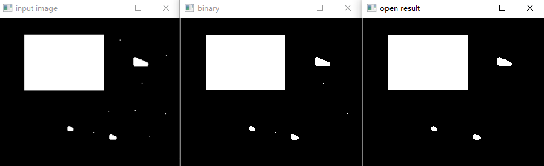
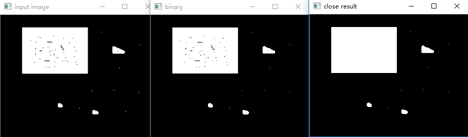

## 膨胀与腐蚀
形态学操作其实就是改变物体的形状，一般作用于二值化图，来连接相邻的元素或分离成独立的元素。


#### 膨胀
膨胀的原理是在原图的小区域内取局部最大值。
###### API
```python
    kernel = cv.getStructuringElement(cv.MORPH_RECT, (5, 5))
    dst = cv.dilate(binary, kernel)
    # 用kernel，扫描图像的每一个像素；用kernel与其覆盖的二值图像做 “与” 操作；如果都为0，结果图像的该像素为0；否则为1.
    # 参数shape:表示内核的形状，矩形：MORPH_RECT    十字形：MORPH_CORSS      椭圆形：MORPH_ELLIPSE;
    # 结果：使二值图像扩大一圈
```

#### 腐蚀
腐蚀的原理是在原图的小区域内取局部最小值。因为是二值化图，只有0和255，所以小区域内有一个是0该像素点就为0。
###### API
```python
    kernel = cv.getStructuringElement(cv.MORPH_RECT, (5, 5))
    dst = cv.dilate(binary, kernel)
    # 用kernel，扫描图像的每一个像素；用kernel与其覆盖的二值图像做 “与” 操作；如果都为1，结果图像的该像素为1；否则为0.
    # 结果：使二值图像减小一圈
```

#### 开操作
开操作：图像形态学的重要操纵之一，基于膨胀与腐蚀操作组合形成的；主要是应用在二值图像分析中，灰度图像亦可。
###### 原理
开操作 = 腐蚀+膨胀 ，输入图像 + 结构元素
###### 作用
用来消除小物体、平滑较大物体的边界的同时并不明显改变其面积，提取水平或竖直的线

###### API
```python
    kernel = cv.getStructuringElement(cv.MORPH_RECT, (5, 5))
    binary = cv.morphologyEx(binary, cv.MORPH_OPEN, kernel)
```

#### 闭操作
闭操作：图像形态学的重要操纵之一，基于膨胀与腐蚀操作组合形成的；主要是应用在二值图像分析中，灰度图像亦可
###### 原理
闭操作 = 膨胀+腐蚀 ，输入图像 + 结构元素
###### 作用
用来填充物体内细小空洞、连接邻近物体、平滑其边界的同时并不明显改变其面积
###### API
```python
    kernel = cv.getStructuringElement(cv.MORPH_RECT, (5, 5))
    binary = cv.morphologyEx(binary, cv.MORPH_CLOSE, kernel)
```

#### 顶帽（Top Hat）：
原图像与开操作之间的差值图像，突出原图像中比周围亮的区域

#### 黑帽（Black Hat）：
闭操作图像与原图像的差值图像, 突出原图像中比周围暗的区域

#### 形态学梯度（Gradient）：
* 基础梯度：基础梯度是用膨胀后的图像减去腐蚀后的图像得到差值图像，称为梯度图像也是opencv中支持的计算形态学梯度的方法，而此方法得到梯度有称为基本梯度。
* 内部梯度：是用原图像减去腐蚀之后的图像得到差值图像，称为图像的内部梯度。
* 外部梯度：图像膨胀之后再减去原来的图像得到的差值图像，称为图像的外部梯度。

##### TIPS
```
morphologyEx(src, op, kernel[, dst[, anchor[, iterations[, borderType[, borderValue]]]]]) -> dst
op参数：操作类型
　　MORTH_OPEN                函数做开运算
　　MORTH_CLOSE              函数做闭运算
　　MORTH_GRADIENT       函数做形态学梯度运算
　　MORTH_TOPHAT            函数做顶帽运算
　　MORTH_BLACKHAT       函数做黑帽运算
　　MORTH_DILATE              函数做膨胀运算
　　MORTH_ERODE             函数做腐蚀运算
kernel参数 ：内核类型，用getStructuringElement函数得到
```
