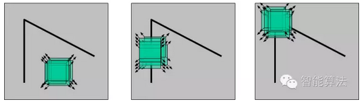

## 图像角点检测
角点 - 感兴趣关键点。
角点是两个边缘的连接点，它代表了两个边缘变化的方向上的点。图像梯度有很高的变化。这种变化是可以用来帮助检测角点的。

#### 关键特征
匹配关键点 是指在场景中可以很容易识别出来的 特性。
应该具有 可识别的独一无二性
###### 图片的特征类型
边缘、角点、斑点

#### Harris角点检测
如果在各个方向上移动这个特征的小窗口，窗口内区域的灰度发生了较大的变化，那么就认为在窗口内遇到了角点。

###### 优缺点
* 优点  
    * 计算简单：Harris 算子中只用到灰度的一阶差分以及滤波,操作简单  
    * 提取的点特征均匀而且合理：Harris 算子对图像中的每个点都计算其兴趣值,然后在邻域中选择最优点。实验表明,在纹理信息丰富的区域,Harris 算子可以提取出大量有用的特征点,而在纹理信息少的区域,提取的特征点则较少。  
    * 稳定：Harris算子的计算公式中只涉及到一阶导数，因此对图像旋转、灰度变化、噪声影响和视点变换不敏感,它也是比较稳定的一种点特征提取算子。  
* 缺点  
    * 它对尺度很敏感，不具有尺度不变性。  
    * 提取的角点是像素级的。  
    * 速度较慢，比FAST慢  
###### API
```
cornerHarris(src, blockSize, ksize, k, dst=None, borderType=None)
src:  输入图像，单通道8位或float32
blockSize： 角点检测中要考虑的邻域大小
ksize：Sobel求导中使用的窗口大小
k: Harris角点检测方程中的自由参数，取值参数为[0.04, 0.06]
```

#### FAST 角点检测
###### 优缺点
* 优点  
    * 速度快
* 缺点  
    * 没有尺度不变性  
    * 没有方向不变性  
    * 准确度没有Harris高  
    


