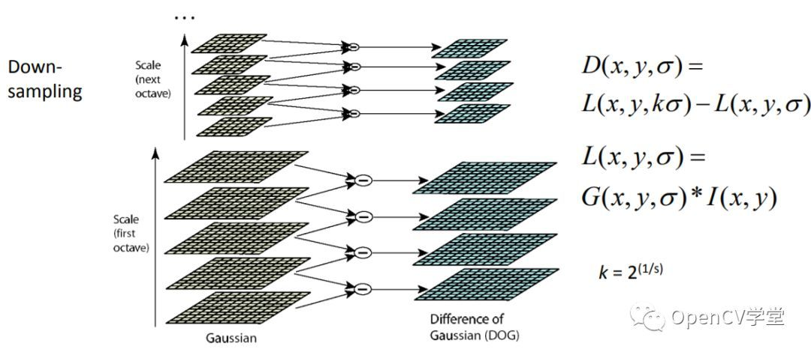
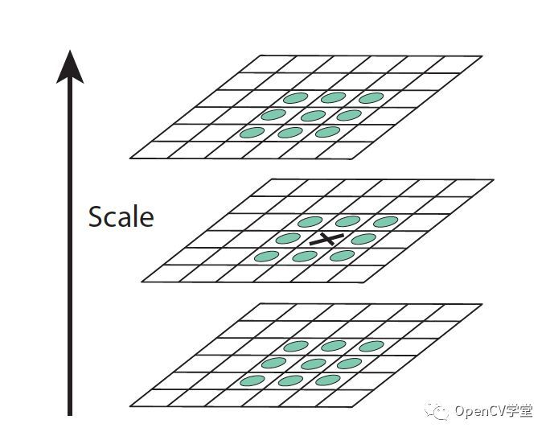
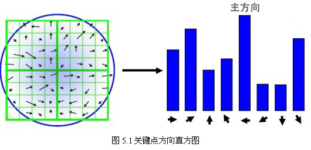
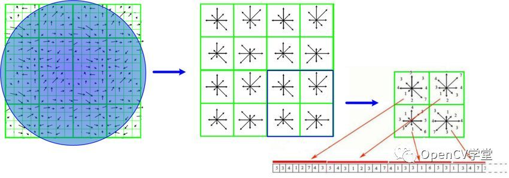

## 图像特征提取与图像描述
`cv.xfeatures2d.SIFT_create()`在python 4.x.x需要安装额外插件，如下：
`pip install opencv-contrib-python`

#### 特征检测和提取算法有
* Harris：该算法用于检测角点；  
* SIFT：该算法用于检测斑点；  
* SURF：该算法用于检测角点；  
* FAST：该算法用于检测角点；  
* BRIEF：该算法用于检测斑点；  
* ORB：该算法代表带方向的FAST算法与具有旋转不变性的BRIEF算法；  

#### SIFT特征算法
实质是在不同的尺度空间上查找关键点(特征点)，并计算出关键点的方向。SIFT所查找到的关键点是一些十分突出，不会因光照，仿射变换和噪音等因素而变化的点，如角点、边缘点、暗区的亮点及亮区的暗点等。
采用DOG代替LOG，速度快，有方向、尺度不变性。    
###### LOG滤波
* LOG： 高斯拉普拉斯算法，利用二阶导数，二阶导极值地方为斑点  
* DOG： 差分高斯算法，计算量比LOG小很多    
###### SIFT特征提取
* 构建高斯多尺度金字塔， 多尺度及金字塔每层有多张不同σ的高斯模糊图片  

* 特征点定位  

* 特征点方向估计  

* 描述子(特征点的特征序列)计算  

